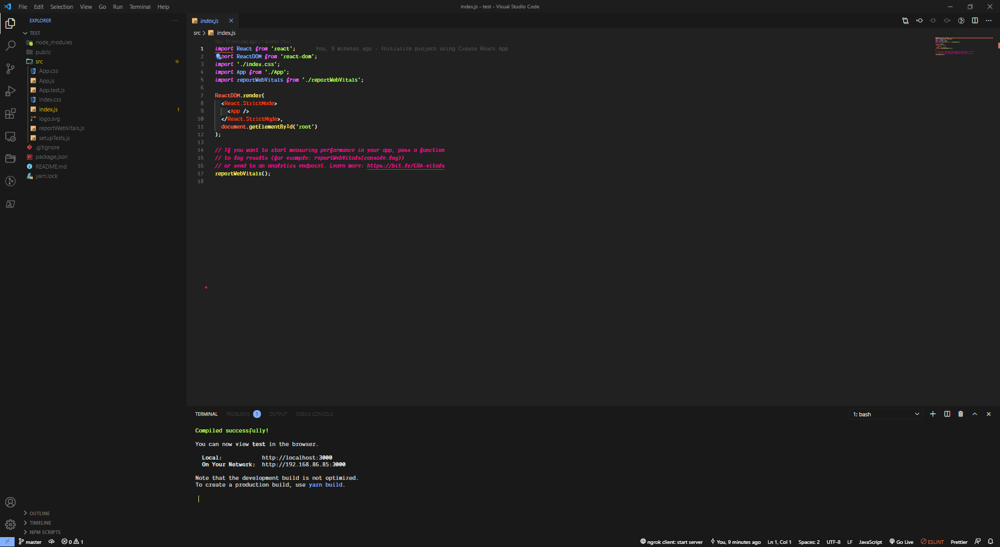
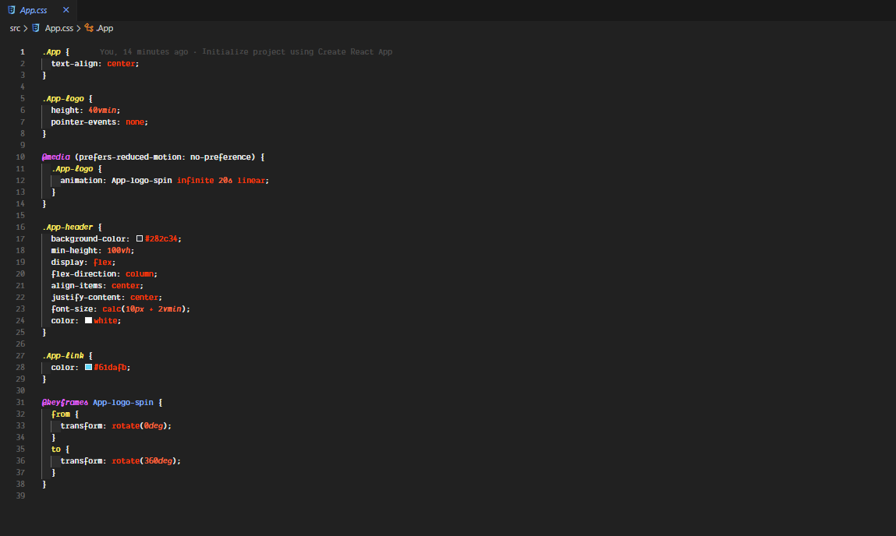
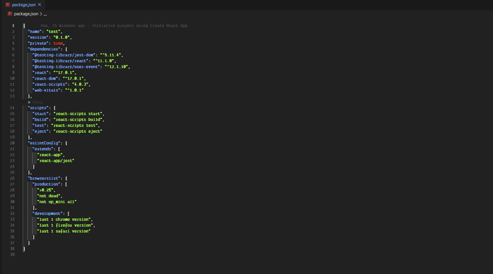

# AURELIUS THEME

A dark theme with base monochromatic colors and vibrant colors.

Meant to work well with fonts that contain italics and ligatures.

Created By: Joe Boylson \
e: joeboylson@gmail.com \
g: https://github.com/joeboylson

---

